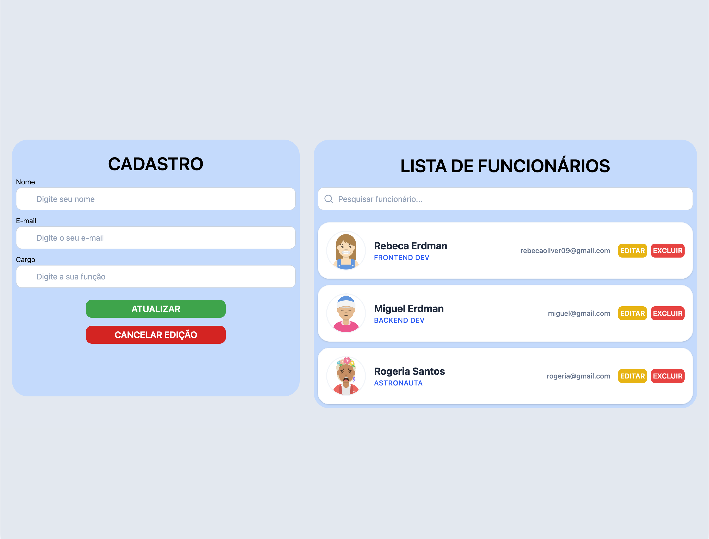

# 🚀 Employee Management - Online CRUD

This is an employee management application developed with **React**, **TypeScript**, and **Tailwind CSS**. The application allows you to perform all CRUD operations (Create, Read, Update, and Delete) by consuming a real API in the cloud.



🔗 **[Access the Live Demo Here](https://rebecafloriano.github.io/user-directory/)**

---

## 💻 About the Project

The goal of this application is to facilitate team control, allowing for centralized management of names, emails, and roles.

The main differentiator of this project is the use of **MockAPI**, which acts as a persistent backend. This means that, unlike `localStorage`, the data you save will be available to anyone who accesses the link from any browser, ensuring a true full-stack experience.

### ✨ Features
* **Employee Listing:** Clear visualization with dynamic avatars.
* **Full Management (CRUD):** Add, edit information, or remove employees from the list.
* **Search Filter:** Quickly locate employees by name, email, or role via the search bar.
* **Automatic Avatars:** Integration with the DiceBear API to generate unique avatars based on the user's name.
* **Responsive Interface:** Design adaptable for mobile and desktop devices.

---

## 🛠️ Technologies Used

* **React** (Vite)
* **TypeScript** (Static typing for increased code safety)
* **Tailwind CSS** (Modern and fast styling)
* **MockAPI** (Remote backend for data persistence)
* **GitHub Actions** (CI/CD flow for automatic deployment)

---

## 🚀 How to Run Locally

If you want to explore the code or make modifications:

1.  **Clone the repository:**
    ```bash
    git clone [https://github.com/rebecafloriano/user-directory.git](https://github.com/rebecafloriano/user-directory.git)
    ```
2.  **Enter the project folder:**
    ```bash
    cd user-directory
    ```
3.  **Install dependencies:**
    ```bash
    npm install
    ```
4.  **Start the development environment:**
    ```bash
    npm run dev
    ```
5.  Access `http://localhost:5173` in your browser.

---

## 📦 Deployment and Continuous Integration

This project uses **GitHub Actions**. Whenever new code is pushed to the main branch (`main`), GitHub automatically:
1. Installs dependencies.
2. Generates the production version (`build`).
3. Deploys it to **GitHub Pages**.

This ensures that the official link is always up to date with the latest version of the code.

---

## 📝 Folder Structure

```text
user-directory/
├── .github/workflows/ # Automatic Deployment Configuration
├── src/
│   ├── components/    # Reusable components
│   ├── App.tsx        # Main logic (States and API Calls)
│   ├── main.tsx       # Entry point
│   └── index.css      # Global styles and Tailwind
├── assets/            # Project images and screenshots
└── db.json            # Local data backup (optional)
